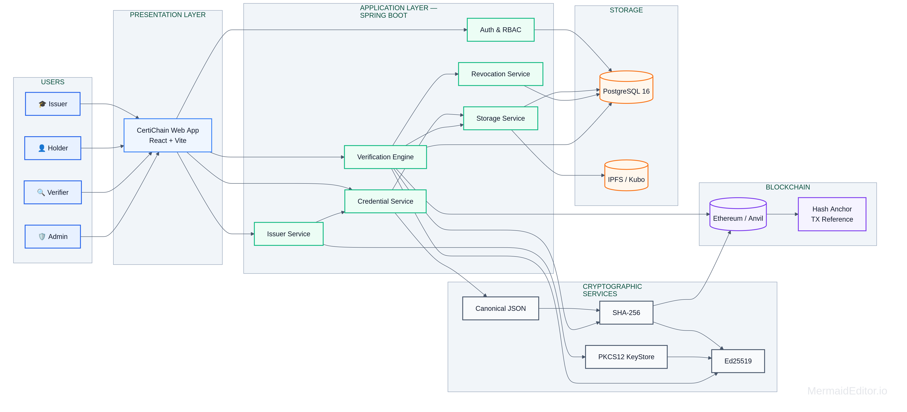

# CertiChain

**Tamper-evident, verifiable digital credentials** — issued as signed PDFs, pinned to IPFS, and anchored on-chain. Anyone can verify a credential without trusting the issuer's database.

[Live Demo](https://certichain-alpha.vercel.app) · [Deployment Guide](deploy/DEPLOY.md)

---

## Overview

CertiChain is a full-stack credential issuance and verification platform. An issuing authority signs a credential with an Ed25519 key pair, the credential document is stored on IPFS (content-addressed), and a hash of the signed content is anchored to a blockchain. A verifier can upload the credential file and get an answer that is independent of the issuer's server:

- **Authentic** — the Ed25519 signature validates against the issuer's registered public key.
- **Unmodified** — the document hash matches the content addressed on IPFS.
- **Current** — the credential has not been revoked.
- **Anchored** — a matching record exists on-chain.

Because verification relies on signatures, content addressing, and an immutable ledger, an issuer cannot quietly alter or backdate a credential after the fact.

---

## Features

| Role | Capabilities |
|------|--------------|
| **Admin** | Review and approve/reject issuers, browse users, audit all verification records |
| **Issuer** | Register, manage Ed25519 signing keys, issue credentials, revoke credentials, view verification activity |
| **Holder** | Maintain a personal wallet of credentials, download the signed credential file |
| **Verifier** | Upload a credential file to verify it, look up an on-chain anchor by credential number, review verification history |

**Public (no account required):** document verification and anchor lookup.

---

## Architecture



---

## Tech Stack

| Layer | Technology |
|-------|-----------|
| Frontend | React 19, Vite 8, Oxlint, lucide-react |
| Backend | Java 21, Spring Boot 3.5, Spring Security, Spring Data JPA |
| Auth | JWT access tokens + httpOnly refresh cookie (BCrypt password hashing) |
| Database | PostgreSQL 16, Flyway migrations |
| Cryptography | Ed25519 signatures, PKCS#12 keystore |
| Storage | IPFS (Kubo) — content-addressed, CID-referenced |
| Blockchain | Anvil (Foundry) — local EVM chain for anchoring |
| API Docs | springdoc-openapi (Swagger UI) |

---

## Repository Structure

```
CertiChain/
├── certchain/               # Spring Boot backend
│   ├── src/main/java/       #   controllers, services, security, domain model
│   ├── src/main/resources/
│   │   └── db/migration/    #   Flyway migrations (V1–V10)
│   └── Dockerfile
├── frontend/                # React + Vite single-page app
│   ├── src/components/      #   UI (issuer, holder, verifier, admin, account)
│   ├── src/context/         #   auth / session context
│   ├── src/services/        #   API clients
│   └── vercel.json          #   Vercel rewrites to the backend
├── deploy/                  # Production deployment assets
│   ├── docker-compose.prod.yml
│   ├── ec2-setup.sh
│   ├── env.production.example
│   └── DEPLOY.md
└── docker-compose.yml       # Local development stack
```

---

## How It Works

### Issuing a credential
1. The issuer uploads the credential content; the backend computes its hash.
2. The content is pinned to **IPFS** and an IPFS **CID** is recorded.
3. The hash is signed with the issuer's **Ed25519** private key (held in a PKCS#12 keystore).
4. A hash anchor is written to the **blockchain**, producing an on-chain record.
5. The signed credential (with its signature, CID, and credential number) is emitted as a file for the holder.

### Verifying a credential
1. The verifier uploads the credential file (public endpoint — no login needed).
2. The backend parses the embedded signed envelope and re-fetches the content from **IPFS** by CID.
3. It checks the content hash, then validates the **Ed25519 signature** against the issuer's registered public key.
4. It checks the credential's **revocation status** and its **on-chain anchor**.
5. The result is returned as `VERIFIED`, `TAMPERED`, or `REVOKED`, and the attempt is recorded for auditing.

---

## Security Model

- **Ed25519 signatures** — issuers hold key pairs; private keys are stored in a password-protected PKCS#12 keystore that is **auto-generated on first boot** and persisted in a Docker volume.
- **Password hashing** — BCrypt.
- **Sessions** — short-lived JWT access tokens (60 min) plus a refresh token delivered as an `httpOnly`, `Secure` (in production), `SameSite=Lax` cookie scoped to `/api/auth`.
- **Stateless authorization** — role-based access (`ADMIN`, `ISSUER`, `HOLDER`, `VERIFIER`) enforced in the Spring Security filter chain.
- **Rate limiting** — a dedicated filter guards sensitive endpoints.
- **Security headers** — HSTS, `Referrer-Policy: no-referrer`, and a `default-src 'self'` Content-Security-Policy.
- **CORS-free frontend integration** — the browser talks only to the Vercel origin; Vercel rewrites `/api/*` to the backend server-side.

---

## Getting Started (Local)

**Prerequisites:** Docker + Docker Compose.

```bash
git clone https://github.com/yash1648/certichain.git
cd certichain

# Start Postgres, IPFS, Anvil, the backend, and the frontend
docker compose up --build
```

| Service | URL |
|---------|-----|
| Frontend | http://localhost:5173 |
| Backend API | http://localhost:6969 |
| Swagger UI | http://localhost:6969/swagger-ui/ |

Flyway applies all migrations automatically on first backend start.

### Running the frontend against a local backend (hot reload)

```bash
cd frontend
npm install
npm run dev        # Vite dev server with a proxy to localhost:6969
```

---

## Environment Variables

The backend is configured entirely through environment variables (see `certchain/src/main/resources/application.yaml`).

| Variable | Purpose |
|----------|---------|
| `CERT_DB_URL` | JDBC URL of the PostgreSQL database |
| `CERT_DB_USERNAME` / `CERT_DB_PASSWORD` | Database credentials |
| `SSDCVE_JWT_SECRET` | JWT signing secret (≥ 32 bytes, generate with `openssl rand -hex 32`) |
| `SSDCVE_KEYSTORE_PASSWORD` | Password for the PKCS#12 signing keystore |
| `SSDCVE_IPFS_API_URL` | IPFS API endpoint (e.g. `http://ipfs:5001`) |
| `SSDCVE_BLOCKCHAIN_RPC_URL` | EVM RPC endpoint (e.g. `http://anvil:8545`) |
| `SSDCVE_BLOCKCHAIN_FROM` | Address used to send anchor transactions |
| `SSDCVE_BLOCKCHAIN_CHAIN_ID` | Chain ID (Anvil defaults to `31337`) |
| `CERTICHAIN_AUTH_COOKIE_SECURE` | Set `true` when served over HTTPS |

> Do not use the default JWT secret or keystore password in production.

---

## API Reference

Base path: `/api`. Full interactive docs at `/swagger-ui/`.

| Method | Endpoint | Access |
|--------|----------|--------|
| POST | `/api/auth/register` | Public |
| POST | `/api/auth/login` | Public |
| POST | `/api/auth/refresh` | Public (refresh cookie) |
| POST | `/api/auth/logout` | Public |
| POST | `/api/issuer/register` | Authenticated |
| POST | `/api/issuer/keys` | ISSUER / ADMIN |
| POST | `/api/issuer/credentials` | ISSUER / ADMIN |
| GET | `/api/issuer/credentials` | ISSUER / ADMIN |
| GET | `/api/issuer/credentials/{id}` | ISSUER / ADMIN |
| POST | `/api/issuer/credentials/{id}/revoke` | ISSUER / ADMIN |
| GET | `/api/issuer/verifications` | ISSUER / ADMIN |
| GET | `/api/holder/wallet` | HOLDER / ADMIN |
| POST | `/api/holder/wallet/{credentialId}` | HOLDER / ADMIN |
| DELETE | `/api/holder/wallet/{credentialId}` | HOLDER / ADMIN |
| GET | `/api/holder/credentials/{id}/download` | HOLDER / ADMIN |
| POST | `/api/verifier/verify` | Public |
| GET | `/api/verifier/anchor/{credentialNumber}` | Public |
| GET | `/api/verifier/history` | Authenticated |
| GET | `/api/admin/issuers` | ADMIN |
| POST | `/api/admin/issuers/{id}/verify` | ADMIN |
| GET | `/api/admin/users` | ADMIN |
| GET | `/api/admin/verifications` | ADMIN |

---

## Deployment

The project is deployed as three independent pieces:

| Piece | Host |
|-------|------|
| Frontend | Vercel (static build + rewrites) |
| Backend + IPFS + Anvil | AWS EC2 (Docker Compose) |
| PostgreSQL | Neon (serverless Postgres) |

See **[deploy/DEPLOY.md](deploy/DEPLOY.md)** for the full step-by-step guide, environment templates, and rollback procedure.

---

## Team

<!-- Fill in your team details -->

| Name | GitHub |
|------|--------|
| Yash Bagal | [@yash1648](https://github.com/yash1648) |
| Rohit Borase | [@rohiit72](https://github.com/rohiit72) |
| Riya Patil | None |
| Hariom Deore | None |

---

## AI Usage Disclosure

In line with the competition rules, the team **discloses that AI-assisted tools were used** in the development of this project.

**AI tools used:** opencode, antigravity

**Where AI assistance was used:**
- Generating and refactoring code (backend services and controllers, React components)
- Debugging build, runtime, and deployment errors
- Drafting deployment configuration (Docker, Vercel rewrites, AWS/EC2 setup)
- Drafting parts of this documentation

**Human oversight and responsibility:**
- All AI-assisted code was reviewed, tested, and adapted by team members before being committed.
- Architecture, data model, security decisions, and the credential design were directed and validated by the team.
- The team takes full responsibility for the correctness, security, and originality of the final submission.

<!-- Please verify and edit the tool list above so this disclosure is accurate. -->

---

## License

This project is licensed under the MIT License — see the [LICENSE](LICENSE) file for details.

